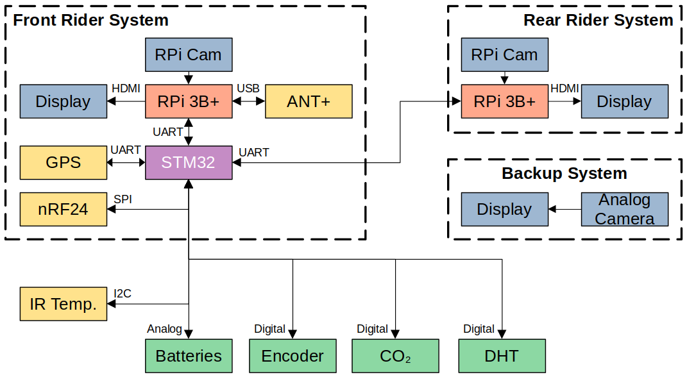

# TITAN Video System

This is the code and hardware that is used to drive the electronics aboard TITAN for the "drive-by-video" system used for the World Human Powered Speed Challenge 2022.

This code is spread across two types of devices, an STM32 microcontroller (STM32F103C8 is used in current models) and Raspberry Pis (RPi) Model 3B+'s. Each rider has an RPi for a total of two units, while there is only one STM32 for the vehicle. The STM32 is primarily responsible for collecting vehicle data and passing it to the RPis when requested. The RPis are responsible for displaying the video feed from the RPi Cameras used (hence why each rider needs their own) with an overlay of data collected inside the vehicle. This overlay is tailored to each rider.

There is an additional redundant video system for the front rider based on analog video to minimize potential failure points. This system was entirely off the shelf except for the power regulator, and was entirely disconnected from the remainder of TITAN's electronics to prevent any failure cascade affecting it.

## Folders

The repository is split into folders based on function.

Folder | Purpose
------ | -------
`Hardware` | Hardware files for our circuit boards
`Microcontroller Code` | STM32 Code
`vision` | RPi video code in C

## Hardware

The hardware for TITAN was all designed in [KiCad](https://www.kicad.org/) there are all three boards designed for TITAN with a `readme.md` explaining their purposes. Below is a block diagram of the TITAN system.

## Microcontroller Code

This is the collection of code prepared for the microcontroller on TITAN. It contains the unit tests we prepared when developing and testing different features that would eventually be integrated into TITAN, a local copy of the GPS library we use, and the overall program for TITAN.

TITAN was initially coded entirely within the Arduino IDE, however we migrated to using VS Code and PlatformIO to help make development easier and also make use of debugging features absent in the original Arduino IDE.

## Raspberry Pi Code
These are responsible for putting video on the displays for the riders to see, overlaid with information about TITAN. One of the RPi's has an ANT+ USB module used to collect data from the heart rate monitor and power pedals each rider has and feed it to the STM32 to pass onto the other RPi. 

**The program for running the video feed is run as a seperate process to the overlay**, this way if there is a hardware malfunction for the overlay (e.g. the STM32 freezes) then the video feed is uniterrupted for the riders.

The code for vision is split between Python and C. The video related code is written in Python, as well as a few other scripts for operation. The overlay code is written in C using the chipset driver library unique to the RPi 3 hardware to draw the overlay so it cannot be used on RPi models other then the 3B or 3B+ (and must be compiled specifically for each model).
